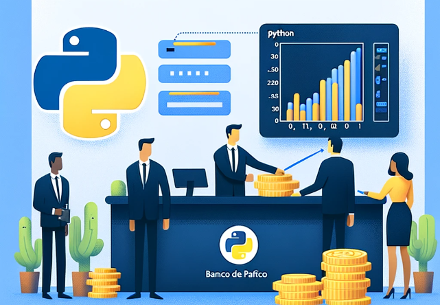
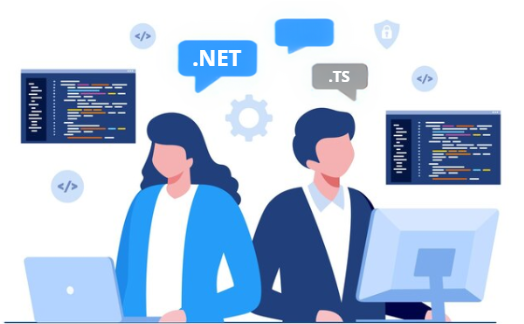
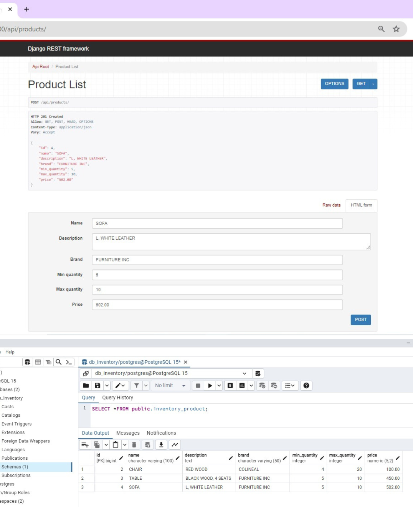

#### *Technical Skills* **->** C, C#, C++, Python, SQL, Java, AutomationAnywhere

## Work Exprience
### Internship @ Banco del Pacífico
#### Project: Fraud Detection Automation

  

**Summary:**
At Banco del Pacífico, in addition to my regular duties, I undertook the development of a small-scale project aimed at enhancing transaction record-keeping and detecting potentially fraudulent activities. The project focused on automating the process of aggregating transaction data and flagging transactions that exceeded predefined frequency and value thresholds, indicating potential fraudulent sources.

**Problem:**
Banco del Pacífico required a solution to simplify the management of transaction records to identify potentially fraudulent activities. Manual processes were time-consuming and lacked efficiency in flagging suspicious transactions that exceeded predefined thresholds.

**Solution:** Development of a Python script to aggregate transaction data from monthly Excel files, generating summary tables. An Automation Anywhere bot executed the Python script, in order to enable user-friendly automation.

**Key Features:**
- Python script processed Excel data, summarizing transaction details (account numbers, transaction counts, total amounts).
- Automation Anywhere bot executed the script, providing users with a familiar interface for initiating the process.
- Enhanced user experience with data visualization through bar charts, assisting in data interpretation and analysis.

**Impact:**
- Optimized fraud detection process, improving efficiency and accuracy.
- Mitigated potential financial risks by identifying suspicious transaction patterns.
- Demonstrated proficiency in automation, Python scripting, and user-centric design.

### Laboratory Technician @ Escuela Superior Politécnica del Litoral
#### Project: Passive Warehouse Management Platform

  

**Summary:**
In a collaborative effort within a four-member team, I served as one of two backend developers while working on the Passive Warehouse Management Platform. Specializing in .NET/C#, my primary responsibility involved designing and implementing the backend architecture, including database structures and API endpoints. Our collective goal was to optimize the asset management process within the institution, targeting the inefficiencies inherent in handling assets assigned to custodians and transferring them to a passive warehouse, which involved cumbersome paperwork and resultant delays.

**Problem:**
Cumbersome paperwork for asset transfer, coupled with limited passive warehouse space, resulted in inefficient asset management.

**Solution:** Our solution involved the creation of a user-friendly web platform empowering custodians to initiate asset transfer requests directly to the passive warehouse. These requests underwent swift approval by the warehouse administrator, with the entire process seamlessly managed through the platform. Additionally, we introduced a dedicated section where custodians could share surplus assets in good condition, enabling other custodians to request them for their work areas, thereby preventing unnecessary occupation of warehouse space.

**Key Features:**
- Led backend development and API implementation, designing relational database tables and developing API endpoints.
- Conducted meetings with passive warehouse administration to align platform functionalities with process requirements.
- Implemented JWT token-based authentication for secure user access.
- Customized platform interface based on user roles, enabling efficient request submission and management.
- Collaborated closely with frontend developers to ensure seamless integration of backend functionalities with frontend design.
  
**Impact:**
- Streamlined asset management process, reducing paperwork and administrative delays.
- Optimized asset utilization by facilitating redistribution among custodians through the collaborative asset pool.
- Successfully finished the project in three months as planned, meeting all requirements and delivering a strong solution.

## Personal Projects
### Django API

**Description:** As part of my self-directed learning journey to improve and expand my skills in web development with Python, I've been exploring Django and developed a basic API using Django REST Framework for managing a product inventory. This project, powered by PostgreSQL as the backend database, allows me to practice CRUD operations and deepen my understanding of Django and RESTful API development.

**Repository:**[Link to the repository](https://github.com/adalava99/practice_project.git)

  

